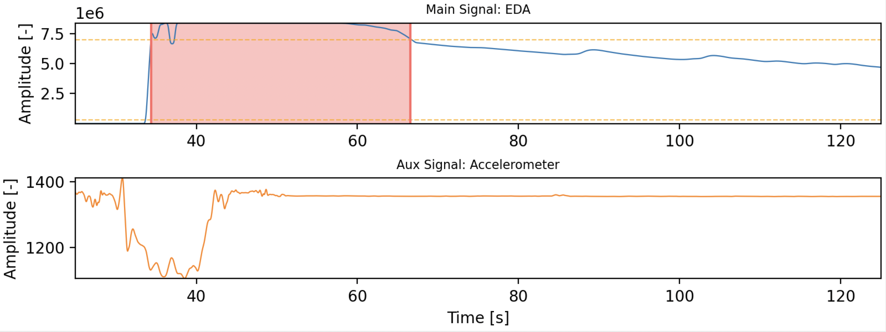
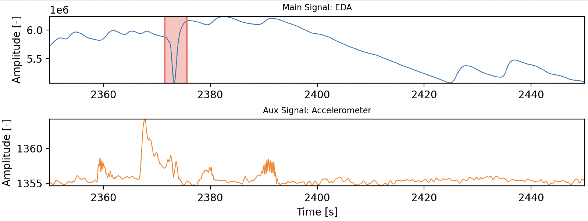
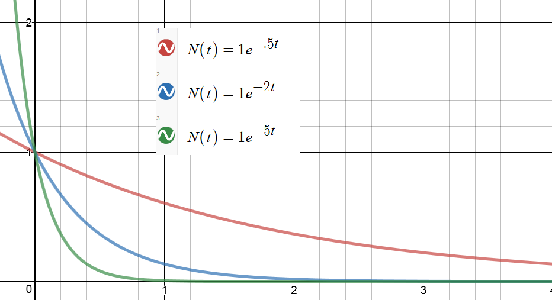
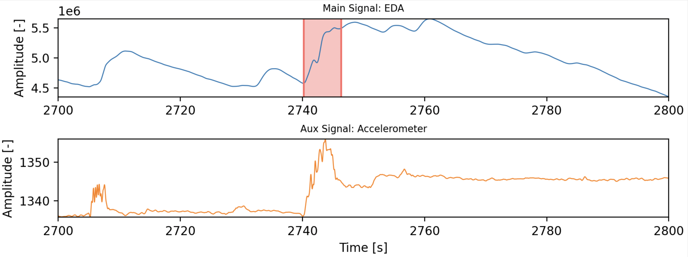
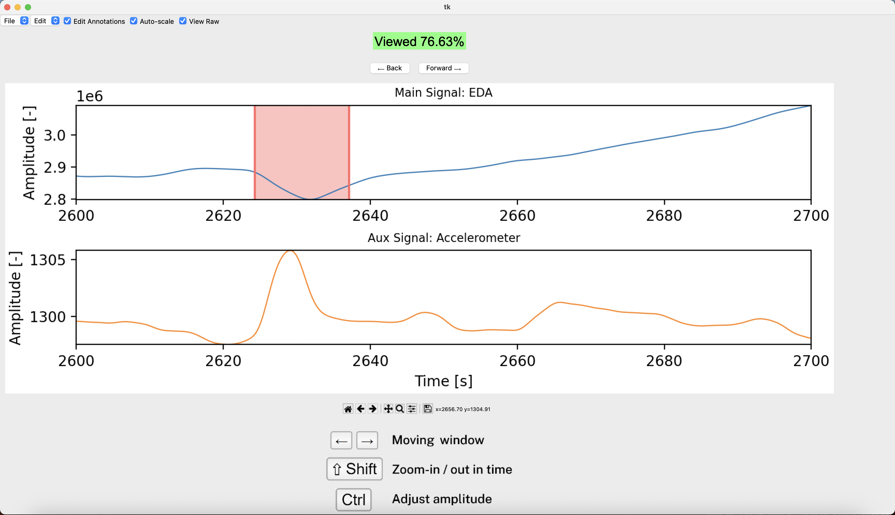

# Sock Motion Artifacts

## Objetivo
Este repositório serve como plataforma para a **anotação de sinais de EDA**, no âmbito da produção de um artigo científico de elevado impacto.  

## Background
Para garantir a qualidade e relevância do estudo, seguimos os seguintes princípios fundamentais na investigação científica:  

- **Statistical Power**: Garantia de um número adequado de amostras.
- **Mitigação de viés**: As anotações são realizadas por múltiplos anotadores (> 2), independentes do autor dos métodos, todos com expertise em sinais fisiológicos.  
- **Blind annotation**: A anotação é feita de forma **cega**, evitando o conhecimento de variáveis potencialmente "confounding" que possam enviesar o processo. Isto significa que apenas o EDA da meia será utilizado na visualização de dados.
- **Critérios bem definidos**: Utilização de **guidelines consistentes e baseadas em literatura prévia**, assegurando a comparabilidade e a reprodutibilidade dos resultados.

## O Dataset
- **Sujeitos**: Atualmente o dataset inclui **N = 32 sujeitos**.
- **Tempo de aquisição**: Cerca de **60 minutos** (32 sujeitos x 1h = **32 horas totais**).
- **Modalidades**: Apesar de terem sido gravados mais dados, para a anotação, utilizamos apenas o **sinal de EDA (principal) e acelerómetro (secundário / auxiliar; é usada um sinal que combina informação dos 3 eixos).**

## Critérios para a anotação
1. EDA **out of range** (saturação <500k ou >7M).
<p align="center">
  
</p>

2. **Variações elevadas** na amplitude do EDA.
3. EDA decay dos picos **não é segue a função exponencial** (exceto se houver 2 picos juntos).
<p align="center">
  
</p>
<p align="center">
  
</p>

4. Quando 2. e 3. acontecem e há uma **similaridade** elevada (visualmente) **entre o EDA e o sinal de ACC**.
<p align="center">
  
</p>

## Como iniciar o projeto?
1. Abrir o terminal numa diretoria nova e correr: ```git clone git@github.com:afonsof3rreira/Sock_MotionArtifacts.git```
2. Descarregar os dados contidos na pasta ```Raw.zip``` e colocar os sinais dentro da pasta do projeto ```root/Data/Raw```:
https://ulisboa-my.sharepoint.com/:u:/g/personal/ist186689_tecnico_ulisboa_pt/ERewEffBGFxOhoXleYN82QgBu2Liv6b_aHK5IQKxAs0_8w?e=SM92uF
2. Garantir que a pasta ```root/Data/Annotations``` está vazia (tem apenas git-ignore).
3. Abrir no IDE de preferência (e.g. PyCharm) e, após criar e ativar um venv, correr ```pip install numpy matplotlib pandas peakutils biosppy```
4. Correr a script ```main.py```

## Como usar a plataforma?
1. Quando correres main.py podes fazer resize da janela. Tenta **não mexer no seu tamanho uma vez definido** para evitar lag
2. Utiliza as teclas arrows left, right parar navegar para a esquerda e para a direita. Quando clicares pela primeira vez na arrow right ou left, o visualizador vai ter à primeira janela do lado esquerdo (início do sinal), e depois começamos a andar para a direita (forward no tempo).
3. **Para anotar, clicamos com o rato no sinal de cima** para definirmos o intervalo no sinal de EDA que queremos. Ao segundo click, é formado esse intervalo
4. **Para apagar** o intervalo, clicamos com o **right-click** do rato sobre o intervalo
3. Quando o sinal for todo visualizado, o texto no topo da janela irá dizer **"Viewed 100% - Done! (move onto next one ⟶)" em azul**.
4. Quando mudamos de sinal (botões com setas p/ esquerda ou direita no topo), **os dados são gravados automaticamente.**
5. Se quisermos fechar o programa a meio sem mudar de sinal, **também gravar usando Ctrl+s ou Cmd+s**.
6. Idealmente, não precisas de mexer nos botões do canto superior esquerdo, estes são remanescentes de outra plataforma.

