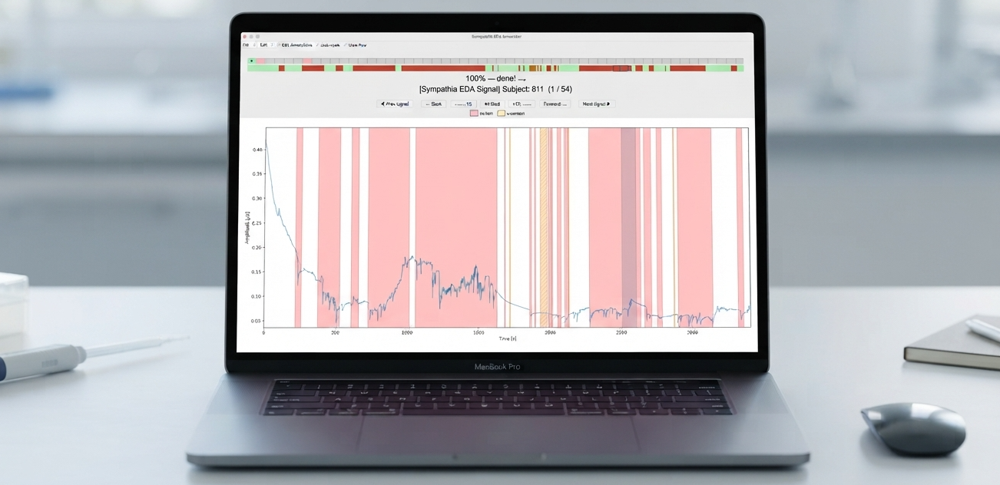

# Biosignal Artifacts Annotation Platform
## EDA annotation — Sympathia Sense & BITalino

<p align="center">
  
</p>

## Objective
This repository contains the platform for **Electrodermal Activity (EDA) signal annotation**.

The data labeled here will contribute to a high-impact scientific publication focused on motion artifact detection and mitigation in wearable devices.

## What you're annotating
**53 subjects × 2 devices** (Sympathia and BITalino), roughly 60 minutes of recording each. You annotate one device at a time. 

When you run the script:
1) The platform opens the Sympathia dataset. 
2) After you close the window, the platform re-opens with the BITalino dataset.

The EDA signals are **shown in microsiemens (µS)** and are minimally filtered (a 4th-order low-pass Butterworth at 5 Hz followed by light smoothing, with a 0.75 s window). This removes mostly high-frequency noise. Therefore, the morphology of the signal and significant artifacts are preserved.

Annotation is **blind** (no metadata) and subject order is shuffled per annotator, so your sequence will differ from everyone else's. Multiple annotators label the same data independently, so please don't compare notes on specific subjects while annotating.

---

## Annotation Criteria

Artifact segmentation is not absolute, but rather subjective and a **best-effort judgement**.

Mark any segment where the EDA signal does not plausibly reflect electrodermal activity, where something other than the participant's physiology is driving what you see.

Common cases include saturation (the trace flattening against the sensor's limit), sharp non-physiological spikes or steps, and decay phases that don't follow the expected EDA decay/shape. Treat these as examples rather than a checklist; trust your judgement on anything that looks wrong for reasons not listed here.

> **On units:** the displayed µS values come from raw ADC counts through a **non-linear** conversion, so saturation doesn't occur at any fixed µS value and the same ADC limit maps differently across recordings. Judge it by the flat, clipped shape rather than by the y-axis number.

### Marking an artifact as 'uncertain'
If you are unsure whether a segment is a genuine artifact, mark the range and then **toggle it to "uncertain"**. Uncertain ranges are stored with a distinct label and drawn in yellow/hatched pattern, so they can be analysed separately from confident annotations.

Please use this rather than guessing - a segment marked uncertain is useful to the analysis.

---

## How to Use the Platform

### Navigation
| Action                                  | Control                                                         |
|-----------------------------------------|-----------------------------------------------------------------|
| Move one window left / right            | **Left / Right arrow keys**, or **A / D**                       |
| Zoom out to full signal, and back in    | **Left Shift**                                                  |
| Rescale amplitude to the current window | **Left Control**                                                |
| Jump 10 windows                         | **`⟵⟵ -10` / `+10 ⟶⟶`** buttons                                 |
| Jump to start of signal                 | **`⏮ Start`** button                                            |
| Previous / next subject                 | **`◀ Prev signal` / `Next signal ▶`** buttons or clicking       |
| Jump to any subject                     | **Click a square** in the overview bar at the top               |
| Exit the platform                       | **Esc**, or close the window                                    |

> Both **Shift** and **Control** must be the **left-hand** key, as the right-hand ones are not bound.

The overview bar shows every subject as a square: grey for untouched, red for in progress, green for complete, with a blue dot on the subject you are currently viewing. Hover over a square to see its subject ID and progress.

### Annotating
| Action                                | Control |
|---------------------------------------| --- |
| Start a range                         | **Left-click** on the signal |
| End/complete a range                  | **Left-click** again |
| Delete a range                        | **Right-click** on or near an existing range |
| Toggle last range certain / uncertain | **R** |
| Undo last deletion                    | `Cmd+Z` (macOS) / `Ctrl+Z` (Windows/Linux) |

Ranges cannot overlap, and a new range cannot be started inside an existing one. If you left-click once and change your mind, click again to close the range; a zero-width range is discarded.

### Progress and saving
* The progress bar tracks how much of the current signal you have **viewed**, and fills green at 100%.
* Annotations are **saved automatically** whenever you create or delete a range, and when you switch subjects.
* To save manually at any time: `Cmd+S` (macOS) / `Ctrl+S` (Windows/Linux).
* Your position and progress are restored when you reopen the platform, including which subject you were last working on.

### Important
> **Do not open the files in `Data/Annotations` while the platform is running.** Editing or even viewing them in an external program (Excel, PyCharm, a text editor) can cause saves to fail silently or overwrite your annotations with a stale copy.

* You can resize the window at launch, but **avoid resizing it afterward** to prevent interface lag.
* The checkboxes in the upper-left corner (`Edit Annotations`, `Auto-scale`, `View Raw`) are legacy options from an earlier version; leave them at their defaults.

---

## Installation

### Requirements
> **Python 3.12 or newer, installed from [python.org](https://www.python.org/downloads/).**
>
> This is not optional, and `requirements.txt` cannot enforce it. The platform depends on Tk, which ships with the Python interpreter rather than with pip. Interpreters bundling **Tk older than 8.6.13 silently drop mouse clicks on macOS** — annotations appear not to register, with no error message. Anaconda and Homebrew builds vary; a python.org build is the tested configuration.
>
> To check what you have:
> ```bash
> python -c "import tkinter; print(tkinter.Tcl().call('info','patchlevel'))"
> ```
> If this prints anything below `8.6.13`, install a current Python before continuing. The application will also warn you at launch.

### Steps

1.  **Clone the repository:**
    ```bash
    git clone git@github.com:afonsof3rreira/Sock_MotionArtifacts.git
    cd Sock_MotionArtifacts
    ```

2.  **Download the data:**
    Download the data archive and place the contents into `Data/Downsampled`.

3.  **Create and activate a virtual environment:**
    ```bash
    python3 -m venv venv
    source venv/bin/activate          # macOS / Linux
    venv\Scripts\activate             # Windows
    ```
    Verify the environment picked up a recent Tk:
    ```bash
    python -c "import tkinter; print(tkinter.Tcl().call('info','patchlevel'))"
    ```

4.  **Install dependencies:**
    ```bash
    pip install -r requirements.txt
    ```

5.  **Run the application:**
    ```bash
    python -m src.main
    ```
    Run this **from the project root**, not from inside `src/`. Running `python src/main.py` directly will fail with `ModuleNotFoundError: No module named 'src'`.

    Annotation files are created automatically on first launch, you don't need to prepare `Data/Annotations` yourself.

---

## Contact & Credits

Developed by **Afonso Fortes Ferreira** at Instituto Superior Técnico / Instituto de Telecomunicações.

Questions or problems with the platform? [Contact me](mailto:afonsofortes@tecnico.ulisboa.pt).